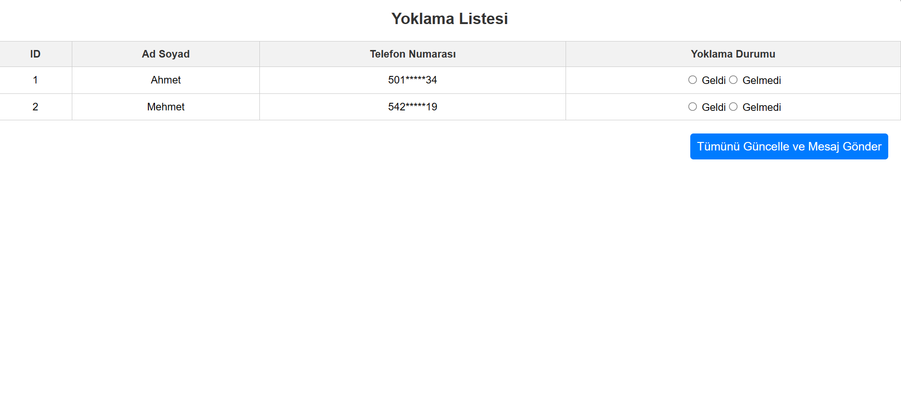
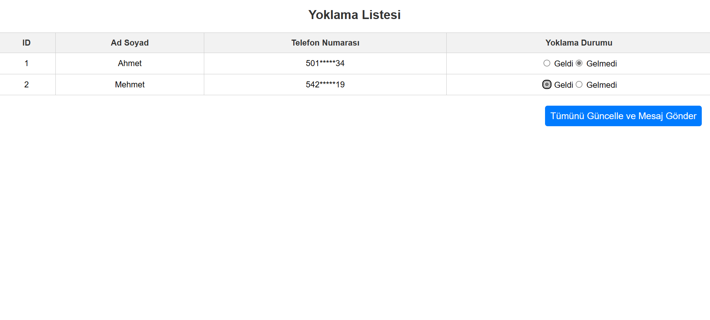
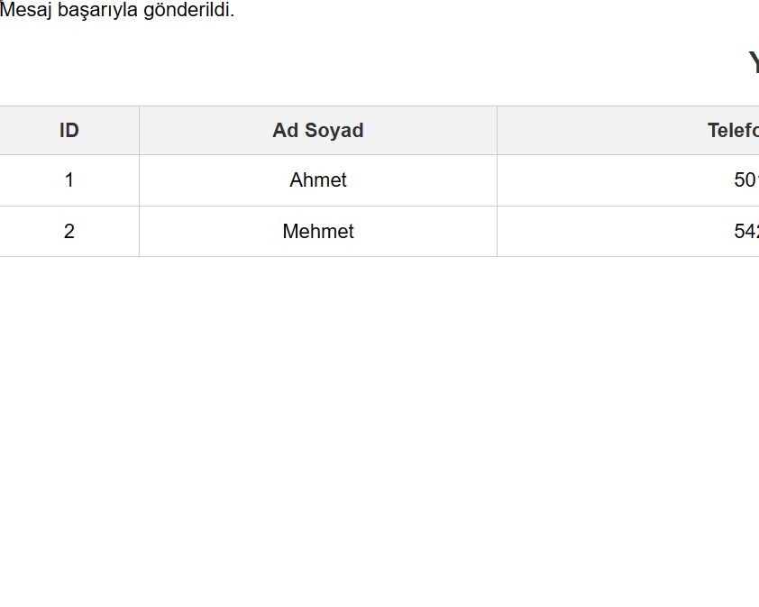
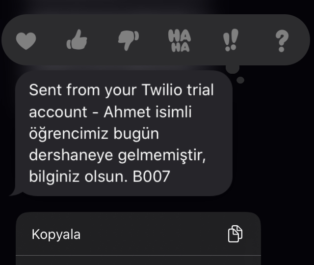

# Öğrenci Yoklama Bildiricisi (SMS)

Bu proje, öğrenci yoklama sistemlerini dijitalleştirmek için tasarlanmıştır. PHP programlama dili kullanılarak geliştirilmiştir ve öğrencilerin sınıfa geliş-gidiş durumlarını izlemek ve güncellemek için kullanılır. Ayrıca, gelmeyen öğrencilere otomatik SMS bildirimi gönderilir.

## Özellikler

- Öğrenci yoklama durumlarını izleme ve güncelleme.
- Gelmemiş öğrencilere otomatik SMS bildirimi gönderme.
- Twilio API kullanarak SMS gönderme işlevselliği.
- Basit ve kullanıcı dostu bir arayüz.

## Kurulum

1. Bu depoyu klonlayın veya indirin.
2. Proje dizinine gidin.
3. Composer kullanarak gerekli bağımlılıkları yükleyin: `composer install`.
4. `send_sms.php` dosyasını açın ve Twilio API anahtarlarınızı girin.
5. Web sunucunuzda projeyi çalıştırın.

## Kullanım

1. Öğrenci listesini görüntüleyin ve yoklama durumlarını işaretleyin.
2. "Güncelle ve Bildirim Gönder" butonuna tıklayarak güncellemeleri kaydedin ve gelmeyen öğrencilere SMS bildirimi gönderin.

## Twilio API Kullanımı

Bu proje, Twilio API'sini kullanarak SMS gönderme işlevselliğine sahiptir. Ancak, Twilio'nun ücretsiz sürümü sınırlıdır. Tam özelliklere sahip olmak için Twilio'nun ücretli planlarına abone olmanız gerekebilir.

Lütfen dikkate alınması gerekenler:
- Twilio API anahtarlarınızı güvenli bir şekilde saklayın ve paylaşmayın.

## Teknolojiler

- PHP
- MySQL
- HTML
- CSS
- Twilio API

## Katkılar

Katkılarınızı bekliyoruz! Herhangi bir hata bulursanız veya önerileriniz varsa, lütfen bir konu açın veya bir pull isteği gönderin.

## Projeye ait görseller

